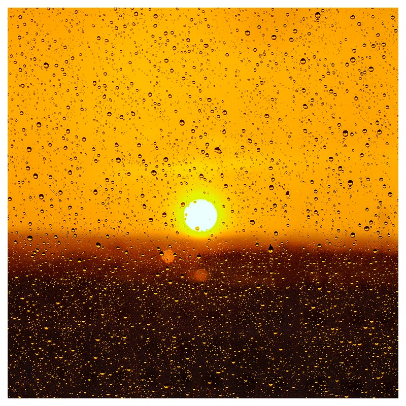

# `Welcome everyone!`

Hello, I am Andreas, a developer, musician and photographer based in Berlin with working experience in the fields of Machine Learning, Data Analytics and Web Development. :rocket:

---

## `My Skillset`

---

## `You can find me on:`

---

If I am not coding I very much enjoy the following activities:

- singing and playing guitar
- music production & songwriting
- photography _(see some of my fotos below)_
- reading
- hiking and traveling

---

## `Sample Fotos`

